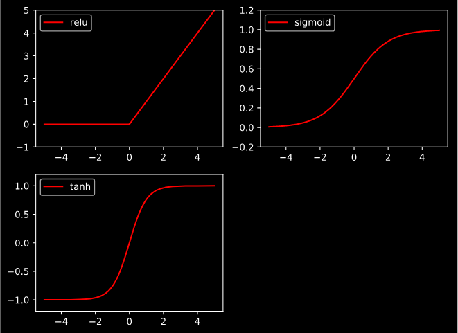

# note
1. 新版本已经放弃使用 requires_grad参数,在torch1.0中已经默认可以追踪计算结果
```python3
variable = Variable(tensor,requires_grad=True)#设置为true即为追踪当前的变量
```

1. torch中的节点是以计算图模型为基础的，和tensorflow相似，使用计算图的好处是在方向更新时方便
`tensor不可以反向传播而Variable可以进行反向传播`
2. torch中有三种类型 Variable、常量、占位符
`Variable.data类型是tensor的`
其中backward()用于求解梯度
3. torch.mm用于矩阵乘法 torch.mul用于点乘
4. 激励函数的选择必须是可微分的，这也是在分类问题中的g(z)选择的是sigmoid的原因
> 卷积神经网络推荐relu 循环神经网络推荐tanh或者relu 多层的不能随便选择，涉及梯度爆炸，梯度消失的问题。

激活函数是非线性的。四种常用的activation


5. 重要的步骤
> * 写自己的net函数 其中需要自己重写__init__函数和forward函数，前者用于搭建神经网络，后者用于反向传播更新参数
> * 之后开始写自己的优化器 一般常用的是随机梯度下降算法即为SGD。并且规定Loss的计算方法，回归为MSE，分类为反对数
> * 最后开始训练，过程为：预测；计算误差；梯度归为0，反向传递(其中梯度归为0的目的是为了在求导钱先将导数归为0)
